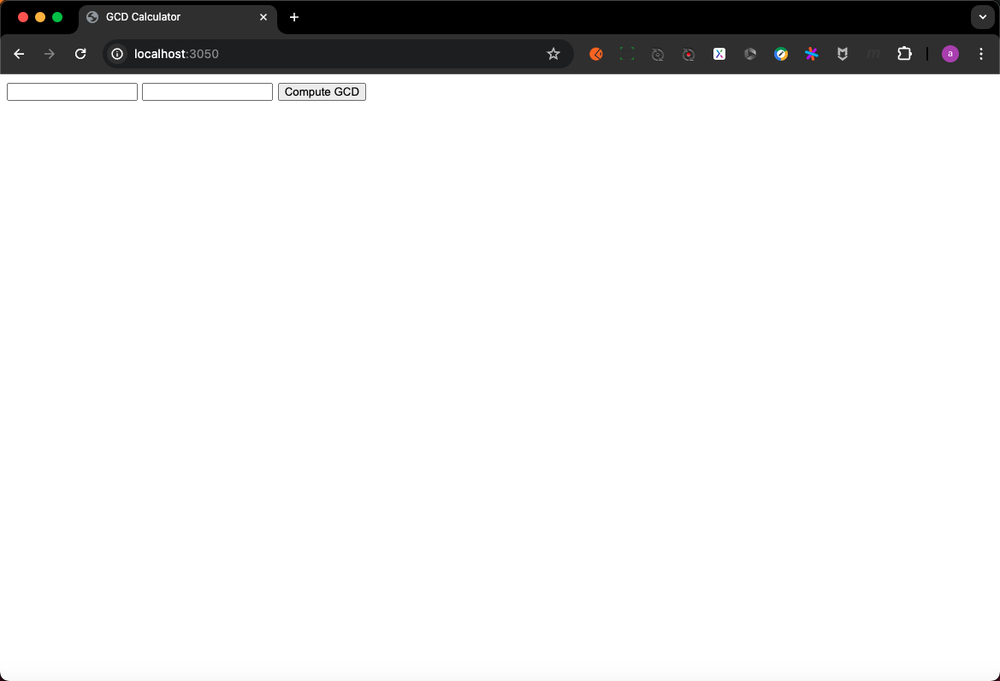
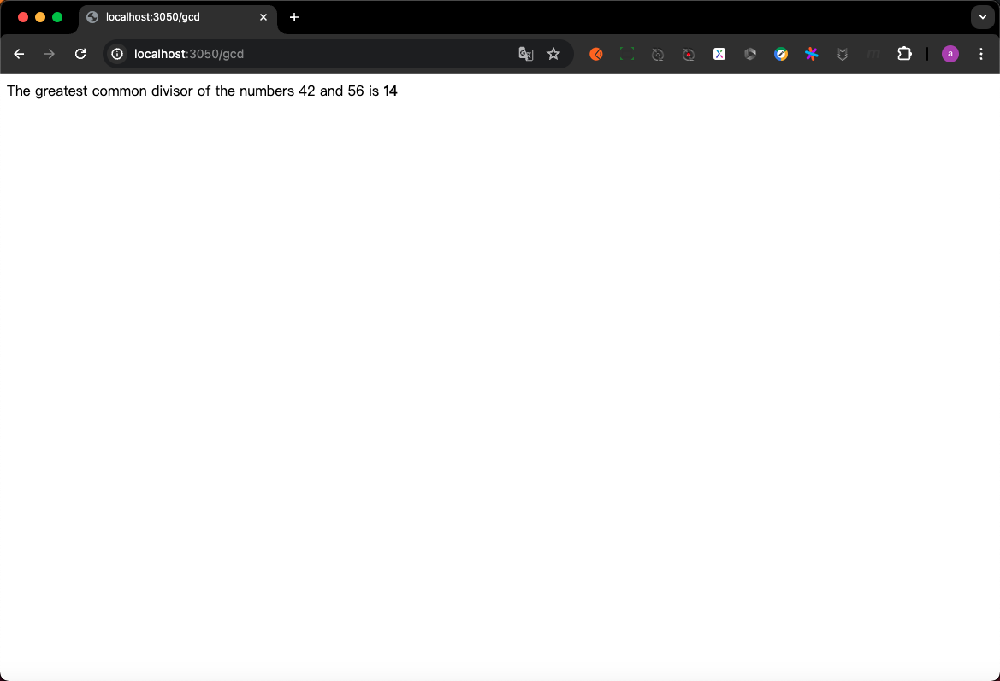

# 2.5 搭建Web服务器

## PART1 使用cargo下载依赖

[Rust语言的官方包管理仓库](https://crates.io/)

在Rust中,无论是库还是可执行文件,都被称为crate.一个crate可以包含多个模块,每个模块可以包含多个函数.

(我理解这就是GO中的package, module, function的关系)

## PART2. 使用actix-web框架

在本例中,我们将使用到`actix-web`(Web框架crate)、serde(序列化crate)以及它们依赖的其他crate

### 2.1 创建工程

```shell
 cargo new arcix-gcd
     Created binary (application) `arcix-gcd` package
```

### 2.2 添加依赖

```toml
[package]
name = "arcix-gcd"
version = "0.1.0"
edition = "2021"

# See more keys and their definitions at https://doc.rust-lang.org/cargo/reference/manifest.html

[dependencies]
actix-web = "4.1.0"
serde = { version = "1.0", features = ["derive"] }
```

- `actix-web`是一个基于Actix框架的Web框架
- `serde`是一个序列化和反序列化库,它可以将数据结构转换为JSON格式
  - 这里的features = ["derive"]是为了使用`#[derive(Serialize, Deserialize)]`宏
  - crate可能会包含某些可选的特性,一部分接口或实现不是所有用户都需要的,但将其包含在这个crate中仍然有意义.在本例中,serde crate就提供了一种处理来自Web表单的数据的方式,但这种方式只有在使用`derive`特性时才能使用

本例中我们要实现的功能为:用户输入2个数字,服务端计算其最大公约数(GCD),并返回结果

### 2.3 下载依赖

```shell
cargo build
    Updating crates.io index
  Downloaded actix-http v3.6.0
  ...
     Compiling arcix-gcd v0.1.0 (/code/arcix-gcd)
    Finished dev [unoptimized + debuginfo] target(s) in 1m 35s
```

## PART3. 实现功能

### 3.1 实现一个简单的HTTP服务器

```rust
use actix_web::{web, App, HttpResponse, HttpServer};

#[actix_web::main]
async fn main() {
    let server = HttpServer::new(|| {
        App::new()
            .route("/", web::get().to(get_index))
    });

    println!("Serving on http://localhost:3050...");

    server
        .bind("127.0.0.1:3050").expect("error binding server to address")
        .run()
        .await
        .expect("error running server");
}

async fn get_index() ->HttpResponse {
    HttpResponse::Ok()
        .content_type("text/html")
        .body(
            r#"
                <title>GCD Calculator</title>
                <form action="/gcd" method="post">
                <input type="text" name="n"/>
                <input type="text" name="m"/>
                <button type="submit">Compute GCD</button>
                </form>
            "#
        )
}
```

- `use actix_web::{web, App, HttpResponse, HttpServer}`中的`{}`部分: 从`actix_web` crate中导入`web`模块,`App`,`HttpResponse`,`HttpServer`类型
  - 这一点和GO不同,GO中即使导入了包,使用时依旧要写成`package.Type`的形式;而Rust中导入了包,使用时可以直接使用包中的类型.比如`route("/", actix_web::web::get().to(get_index))`就可以简写为`.route("/", web::get().to(get_index))`
- `let server = HttpServer::new(|| {...}`:`||`是Rust中的闭包表达式,这里是一个没有参数的闭包表达式,有参数则放在两个`|`中间即可;`{...}`是闭包的主体
  - 在本例中,注意`App::new().route("/", web::get().to(get_index))`的结尾是没有`;`的,因此是将`App::new().route("/", web::get().to(get_index))`作为闭包的返回值(实际上`route()`方法的返回值类型为`App`)
- `r#"..."#"`: Rust中的原始字符串字面量,可以包含任意字符,不需要转义

至此,就有了一个可以运行的HTTP服务器,但是还没有实现计算GCD的功能

```shell
cargo run 
    Finished dev [unoptimized + debuginfo] target(s) in 0.46s
     Running `target/debug/arcix-gcd`
Serving on http://localhost:3050...
```



### 3.2 实现计算GCD的功能

```rust
use actix_web::{web, App, HttpResponse, HttpServer};

#[actix_web::main]
async fn main() {
    let server = HttpServer::new(|| {
        App::new()
            .route("/", web::get().to(get_index))
            .route("/gcd", web::post().to(post_gcd))
    });

    println!("Serving on http://localhost:3050...");

    server
        .bind("127.0.0.1:3050").expect("error binding server to address")
        .run()
        .await
        .expect("error running server");
}

async fn get_index() ->HttpResponse {
    HttpResponse::Ok()
        .content_type("text/html")
        .body(
            r#"
                <title>GCD Calculator</title>
                <form action="/gcd" method="post">
                <input type="text" name="n"/>
                <input type="text" name="m"/>
                <button type="submit">Compute GCD</button>
                </form>
            "#
        )
}

use serde::Deserialize;
#[derive(Deserialize)]
struct GcdParameters {
    n: u64,
    m: u64,
}

async fn post_gcd(form: web::Form<GcdParameters>) -> HttpResponse {
    if form.n == 0 || form.m == 0 {
        return HttpResponse::BadRequest()
            .content_type("text/html")
            .body("Computing the GCD with zero is boring.");
    }

    let response =
        format!("The  greatest common divisor of the numbers {} and {} \
                is <b>{}</b>\n",
                form.n, form.m, gcd(form.n, form.m));
            HttpResponse::Ok()
                .content_type("text/html")
                .body(response)
}

fn gcd(mut n: u64, mut m: u64) -> u64 {
    assert!(n != 0 && m != 0);
    while m != 0 {
        if m < n {
            let t = m;
            m = n;
            n = t;
        }
        m = m % n;
    }
    n
}
```

- `use serde::Deserialize`: 通常是将所有的`use`声明集中放在顶部的
- `struct GcdParameters {...}`: 定义了一个名为`GcdParameters`的新类型,该类型用于用于接收用户输入的数据
  - `#[derive(Deserialize)]`: 这个注解是一个属性,和`#[test]`类似,它告诉Rust编译器为`GcdParameters`类型自动生成`Deserialize` trait的实现
- `format!()`: 类似于GO中的`fmt.Sprintf()`,用于格式化字符串.与`println!()`类似,但是`println!()`是将格式化后的字符串打印到标准输出,而`format!()`是将格式化后的字符串返回

