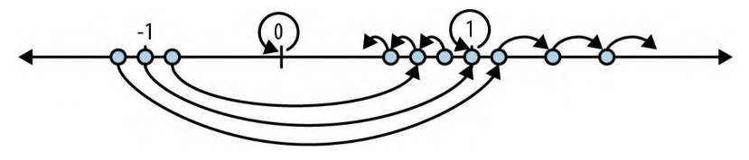

# 2.6.1 什么是曼德博集

使用Rust特有语法实现的loop语句无限循环:

```rust
fn square_loop(mut x: f64) {
    loop {
        x = x * x;
    }
}
```

在现实世界中,Rust能看出`x`从未用来做任何事,因此不会计算它的值

但是我们假定代码能按照编写的方式运行,那么`x`的值将会有如下变化:

- 对任何小于1的数值求平方会使它变得更小,因此它会趋近于0
- 1的平方会得到1
- 对大于1的数值求平方会使它变大,因此它会趋近于无穷大
- 对一个负数求平方会先使其变为正数,之后它的变化情况和前面的情况类似



现在来考虑一个略有不同的循环:

```rust
fn square_add_loop(c: f64) {
    let mut x = 0.0;
    loop {
        x = x * x + c;
    }
}
```

`x`从0开始,我们通过对它求平方后再加上`c`来调整它在每次迭代中的进度

通过一些实验发现,如果`c`大于0.25或小于-2.0,那么`x`最终会变得无限大, 否则,它就会停留在0附近的某个地方

下一个问题: 如果不再使用`f64`而是改用复数做同样的循环会怎样?

[Rust语言的官方包管理仓库](https://crates.io/)上有一个叫做`num`的包,它提供了复数类型,我们可以使用它来实现这个循环

```toml
[package]
name = "mandelbrot"
version = "0.1.0"
edition = "2021"

# See more keys and their definitions at https://doc.rust-lang.org/cargo/reference/manifest.html

[dependencies]
num = "0.4"
```

```shell
mandelbrot % cargo build
    Updating crates.io index
...
    Finished dev [unoptimized + debuginfo] target(s) in 9.66s
```

```rust
use num::Complex;

fn complex_square_add_loop(c: Complex<f64>) {
    let mut z = Complex{ re: 0.0, im: 0.0};
    loop {
        z = z * z + c;
    }
}
```

`Complex`类型是一种Rust结构体类型,其定义如下:

```rust
pub struct Complex<T> {
    /// 复数的实部
    pub re: T,
    /// 复数的虚部
    pub im: T,
}
```

`Complex`类型的`re`和`im`字段都是泛型类型`T`,这意味着`Complex`类型可以用来表示任何类型的复数,只要这个类型支持加法和乘法运算

例如:

- `Complex<f64>`类型表示的是实部和虚部都是`f64`类型的复数
- `Complex<f32>`类型表示的是实部和虚部都是`f32`类型的复数

`num` carte支持使用`*`、`+`和`-`运算符对`Complex`类型的值进行操作,因此我们可以直接使用`z = z * z + c`这样的表达式

曼德博集的定义是:令z不会"飞到"无穷远的复数`c`的集合.

我们最初的简单平方循环是可以预测的:任何大于1或小于-1的数值都会"飞"出去.

把`+ c`放入每次迭代中会使变化情况更难预测:正如前面所说,大于0.25或小于-2.0的c值会导致z"飞"出去.但是将此游戏推广到复数就会生成真正奇异而美丽的图案,这就是我们所要绘制的分形图

由于复数`c`具有实部`c.re`和虚部`c.im`,因此可以把它们视为笛卡儿平面上某个点的`x`坐标和`y`坐标,如果`c`在曼德博集中,就在其中用黑色着色,否则就用浅色.因此,对于图像中的每个像素,必须在复平面上的相应点位运行前面的循环,看看它是逃逸到无穷远还是永远绕着原点运行,并相应地将其着色

无限循环需要一段时间才能完成,但是对缺乏耐心的人来说有两个小技巧

1. 首先,如果不再永远运行循环而只是尝试一些有限次数的迭代,事实证明仍然可以获得该集合的一个不错的近似值.我们需要多少次迭代取决于想要绘制的边界的精度
2. 其次,业已证明,一旦`z`离开了以原点为中心的半径为2的圆,它最终就一定会"飞到"无穷远的地方

所以下面是循环的最终版本,也是程序的核心:

```rust
/// 尝试测定`c`是否位于曼德博集中
/// 若`c`不是集合成员之一,则返回`Some(i)`,其中`i`是`c`离开以原点为中心的半径为2的圆时所需的迭代次数
/// 若`c`可能是集合成员之一(达到迭代次数限制时无法证明`c`不是成员),则返回`None`
fn escape_time(c: Complex<f64>, limit: usize) ->Option<usize> {
    let mut z = Complex{re: 0.0, im: 0.0};
    for i in 0..limit {
        if z.norm_sqr() > 4.0 {
            return Some(i);
        }
        z = z * z + c;
    }
    None
}
```

此函数会接受两个参数:

- `c`是我们要测试其是否属于曼德博集的复数
- `limit`是要尝试的迭代次数上限,一旦超出这个次数就放弃并认为`c`可能是成员

该函数的返回值是一个`Option<usize>`.Rust的标准库中对`Option`类型的定义如下所示:

```rust
pub enum Option<T> {
    None,
    Some(T),
}
```

`Option`是一种枚举类型,因为它的定义枚举了这个类型的值可能是几种变体之一:对于任意类型`T`,`Option<T>`类型的值

- 要么是`Some(v)`,其中`v`是`T`类型的值
- 要么是`None`,表示没有可用的`T`的值

与之前讨论的`Complex`类型一样,`Option`是一种泛型类型:你可以使用`Option<T>`来表示任何一种类型`T`的可选值

在这个例子中,`escape_time()`返回一个`Option<usize>`来指示`c`是否在曼德博集中.如果不在,是迭代了多少次才发现的

如果`c`不在集合中,那么`escape_time()`就会返回`Some(i)`,其中`i`是`z`在离开半径为2的圆之前的迭代次数.否则,`c`显然在集合中,并且`escape_time()`返回`None`

`for i in 0..limit`遍历从0开始到`limit - 1`的整数

`z.norm_sqr()`方法调用会返回`z`与原点距离的平方.要判断`z`是否已经离开半径为2的圆,不必计算平方根,只需将此距离的平方与`4.0`进行比较即可,这样速度更快

以`///`开头的注释是文档注释,它会被Rust的文档生成工具提取出来,并生成HTML格式的文档