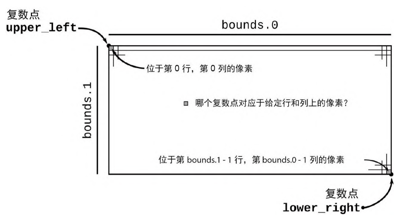

# 2.6.3 从像素到复数的映射

我们的程序需要在两个彼此相关的坐标空间中运行:输出图像中的每个像素对应于复平面上的一个点.

这两个空间之间的关系取决于要绘制曼德博集的哪一部分以及所请求图像的分辨率,这些都要通过命令行参数指定.以下函数会将图像空间转换为复数空间:

```rust
/// 给定输出图像中像素的行和列,返回复平面中对应的坐标
///
/// `bounds`是一个`pair`,给出了图像的像素宽度和像素高度
/// `pixel`是表示该图像中特定像素的(column, row)的二元组
/// `upper_left`和`lower_right`是在复平面中表示制定图像覆盖范围的点
fn pixel_to_point(
    bounds: (usize, usize),
    pixel: (usize, usize),
    upper_left: Complex<f64>,
    lower_right: Complex<f64>,
) -> Complex<f64> {
    let (width, height) = (
        lower_right.re - upper_left.re,
        upper_left.im - lower_right.im,
    );
    Complex {
        re: upper_left.re + pixel.0 as f64 * width / bounds.0 as f64,
        im: upper_left.im - pixel.1 as f64 * height / bounds.1 as f64,
    }
}

#[test]
fn test_pixel_to_point() {
    assert_eq!(
        pixel_to_point(
            (100, 200),
            (25, 175),
            Complex { re: -1.0, im: 1.0 },
            Complex { re: 1.0, im: -1.0 }
        ),
        Complex { re: -0.5, im: -0.75 }
    )
}
```



- `pixel.0 as f64`:Rust通常会拒绝在数值类型之间进行隐式转换,因此你必须写出所需的转换