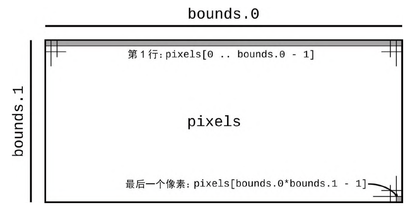
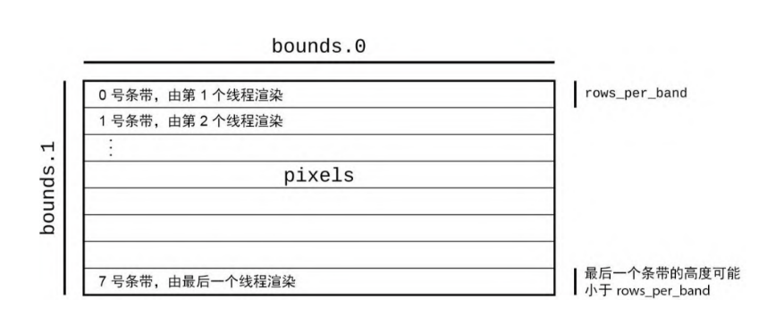

# 2.6.6 并发版曼德博程序

## PART1. 非并发版

```rust
use std::env;

fn main() {
    let args: Vec<String> = env::args().collect();

    if args.len() != 5 {
        eprintln!("Usage: {} FILE PIXELS UPPER-LEFT LOWER-RIGHT", args[0]);
        eprintln!("Example: {} mandel.png 1000x750 -1.20,0.35 -1,0.20", args[0]);
        std::process::exit(1);
    }

    let bounds = parse_pair(&args[2], 'x').expect("error parsing image dimensions");
    let upper_left = parse_complex(&args[3]).expect("error parsing upper left corner point");
    let lower_right = parse_complex(&args[4]).expect("error parsing lower right corner point");

    let mut pixels = vec![0; bounds.0 * bounds.1];

    render(&mut pixels, bounds, upper_left, lower_right);

    write_image(&args[1], &pixels, bounds).expect("error writing PNG file");
}
```

尝试运行:

```bash
cargo run mandel.png 1000x750 -1.20,0.35 -1,0.20
    Finished dev [unoptimized + debuginfo] target(s) in 0.05s
     Running `target/debug/mandelbrot mandel.png 1000x750 -1.20,0.35 -1,0.20`
```


- `vec![v; n]`: 创建一个包含`n`个元素,每个元素都是的值均为`v`的向量
  - `vec![0; bounds.0 * bounds.1]`:创建一个长度为`bounds.0 * bounds.1`的向量,每个元素的值都是`0`



- `render(&mut pixels, bounds, upper_left, lower_right)`:`&mut pixels`借用了`pixels`的可变引用,以便允许`render()`用计算出来的灰度值填充`pixels`的元素,但`pixels`仍然是这个向量的拥有者

## PART2. 并发版

将图像分成多个部分(每个处理器一个),并让每个处理器为分派给它的像素着色.为简单起见,可以将其分成一些水平条带,如下图示:



当所有处理器都完成后,就可以将像素写入磁盘中:

### 2.1 添加依赖

```toml
[package]
name = "mandelbrot"
version = "0.1.0"
edition = "2021"

# See more keys and their definitions at https://doc.rust-lang.org/cargo/reference/manifest.html

[dependencies]
num = "0.4"
image="0.13.0"
crossbeam="0.8"
```

[crossbeam](https://crates.io/crates/crossbeam) crate提供了许多有价值的并发设施,包括这里需要用到的的**作用域线程**设施

将`main()`函数中调用`render()`函数的部分替换为以下内容:

```rust
fn main() {
    let args: Vec<String> = env::args().collect();

    if args.len() != 5 {
        eprintln!("Usage: {} FILE PIXELS UPPER-LEFT LOWER-RIGHT", args[0]);
        eprintln!(
            "Example: {} mandel.png 1000x750 -1.20,0.35 -1,0.20",
            args[0]
        );
        std::process::exit(1);
    }

    let bounds = parse_pair(&args[2], 'x').expect("error parsing image dimensions");
    let upper_left = parse_complex(&args[3]).expect("error parsing upper left corner point");
    let lower_right = parse_complex(&args[4]).expect("error parsing lower right corner point");

    let mut pixels = vec![0; bounds.0 * bounds.1];

    let threads = 8;
    let rows_per_band = bounds.1 / threads + 1;

    {
        let bands: Vec<&mut [u8]> = pixels.chunks_mut(rows_per_band * bounds.0).collect();
        crossbeam::scope(|spawner| {
            for (i, band) in bands.into_iter().enumerate() {
                let top = rows_per_band * i;
                let height = band.len() / bounds.0;
                let band_bounds = (bounds.0, height);
                let band_upper_left = pixel_to_point(bounds, (0, top), upper_left, lower_right);
                let band_lower_right =
                    pixel_to_point(bounds, (bounds.0, top + height), upper_left, lower_right);

                spawner.spawn(move |_| {
                    render(band, band_bounds, band_upper_left, band_lower_right);
                });
            }
        })
        .unwrap();
    }

    write_image(&args[1], &pixels, bounds).expect("error writing PNG file");
}
```

- `let threads = 8`:线程数.这里我们认为设定使用8个线程
- `let rows_per_band = bounds.1 / threads + 1`:每个线程处理的行数
- `let bands: Vec<&mut [u8]> = pixels.chunks_mut(rows_per_band * bounds.0).collect()`:将像素缓冲区划分为几个条带
  - `chunks_mut(rows_per_band * bounds.0)`:将向量划分为几个部分,每个部分都是一个可变引用,且这些部分不重叠.每个部分都是一个`&mut [u8]`切片,其中包含`rows_per_band * bounds.0`个元素
  - `collect()`:将这些切片收集到一个向量中
- `crossbeam::scope(|spawner| {...}.unwrap()`:
  - `|spawner|`:是Rust闭包语法,`spawner`是闭包的参数.与使用`fn`声明的函数不同,无须声明闭包参数的类型,Rust将推断它们及其返回类型
  - `crossbeam::scope()`:调用这个闭包,将一个值作为`spawner`参数传递给闭包,以便在闭包中使用`spawner`来创建新线程
    - `crossbeam::scope()`函数会等待所有线程执行完毕后返回,这种机制让Rust确保这些线程不会在`pixels`超出作用域后再访问分配给自己的那部分像素
      - `crossbeam::scope()`执行成功后返回`Ok(())`,否则返回`Err(panic_info)`.说穿了返回的是一个`Result`
- `unwrap()`:如果`crossbeam::scope()`返回`Err(panic_info)`,则`unwrap()`会引发panic
- `spawner.spawn(move |_|{...})`:创建一个线程,运行`move |_|{...}`闭包
  - `move`:表示闭包会获取其环境中的所有权,而不是借用.换言之,这个闭包会接手它使用的变量的所有权,也就是说,仅有此闭包才能使用可变切片`band`
  - `|_|`:闭包的参数,这里是一个匿名参数,表示接收一个参数但不使用它